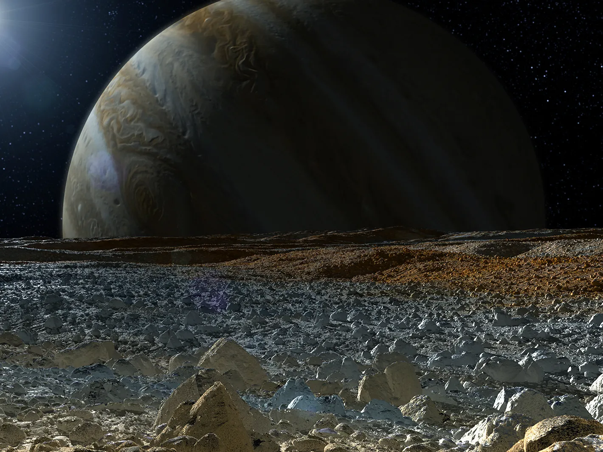
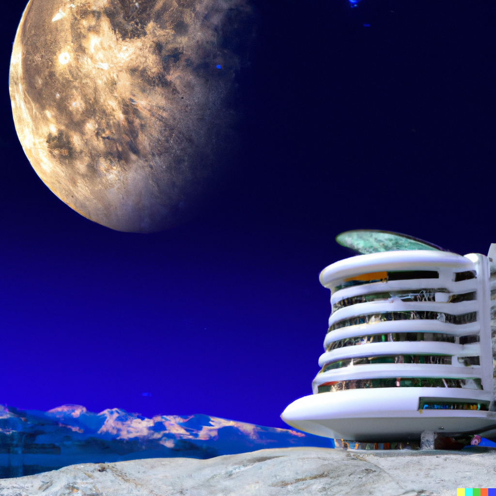
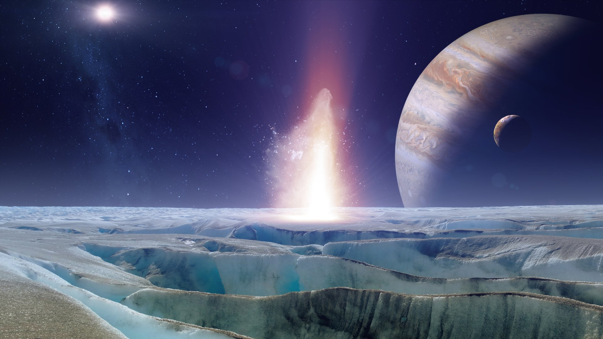

<!--layout: page
title: "Locations"
permalink: [/URL-PATH](https://evanm07.github.io/The_Space_Station/Locations/europa)
-->

<link rel="stylesheet" type="text/css" href="../css/style.scss" />
<link rel="stylesheet" type="text/css" href="../css/location.css" />

<body>
  <h1>The smallest of all moons, but the perfect place to relax and explore</h1>

  <main>
    <section class="img_container">
      
      
      <section>
        

          
The History

          

            Europa is one of the moons of Jupiter and is thought to be one of
            the most likely places in the solar system to find evidence of life
            beyond Earth. It is about the same size as Earth's moon and is made
            up mostly of water ice. Scientists believe that under its frozen
            surface, Europa may have a liquid water ocean, which could
            potentially harbor life. This possibility is based on the presence
            of geysers that have been observed spewing water vapor into space,
            as well as the moon's relatively smooth and young surface, which
            suggests that it is being constantly resurfaced by some process,
            possibly the eruption of water from the subsurface ocean.
          

          

            Come by and see first hand the biggest storms, and the most
            beautiful auroras in the solar system!
          

        

      </section>
      
      
    </section>

    <section>
      

        <h2>About the Trip and Hotel</h2>
        

          <ui>
            <li><strong>Distance: </strong> Approx 628.3 million km</li>
            <li><strong>Travel Time: </strong> Three Days</li>
            <li>
              <strong>Length of Stay:</strong> One Week not including travel
              time
            </li>
            <li><strong>All in Price:</strong> $250,000</li>
          </ui>
        

        

          <li>
            <strong>Amenities: </strong>  
            Swimming Pool  
            Hot tub  
            Five Star breakfast lunch and dinner  
            Beautiful private rooms  
            Stunning view of the earth  
            Tours into and around Jupiter  
          </li>
        

      

    </section>
  </main>

  <button id="home_btn">
    <a href="https://evanm07.github.io/The_Space_Station/"> 
    Home </a> 
  </button>
 
</body>

<!--</body>-->
