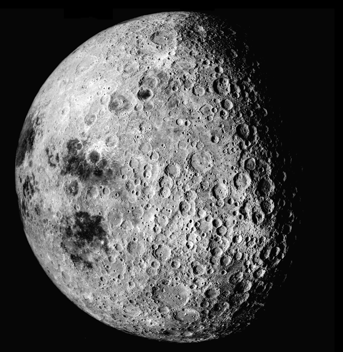
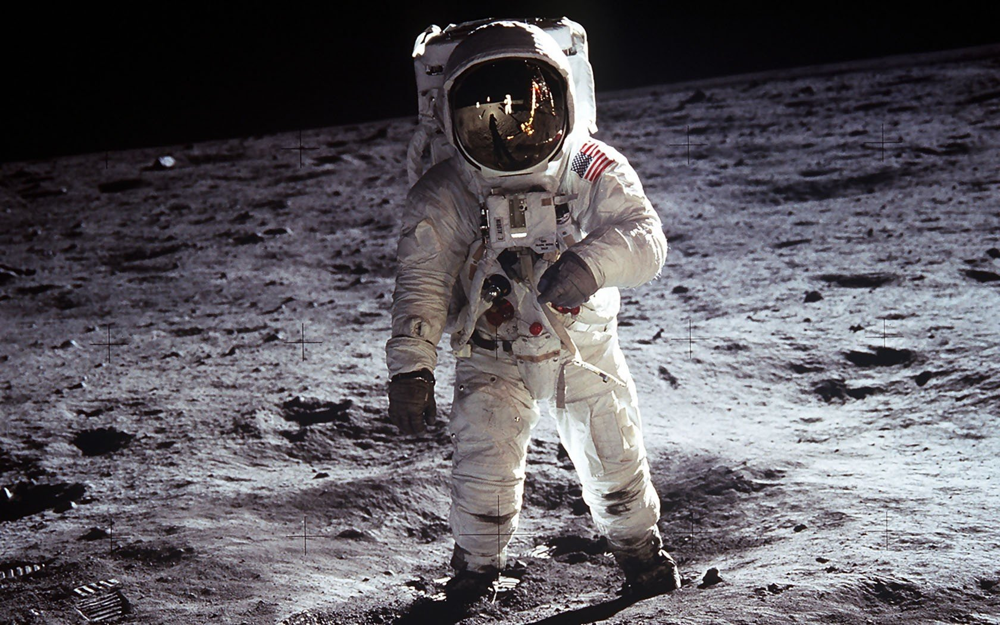

  <!--layout: page
title: "Locations"
permalink: [/URL-PATH](https://evanm07.github.io/The_Space_Station/Locations/moon)
title:false
-->
  <link rel="stylesheet" type="text/css" href="../css/style.scss" />
  <link rel="stylesheet" type="text/css" href="../css/location.css" />

  <body>
    <h1>Explore The Moon</h1>

    <main>
      <section class="img_container">
        
        
        <section>
          

            
The History

            

              The Moon is the Earth's only natural satellite. It is about
              one-quarter the size of the Earth and is about 238,855 miles away
              from Earth on average. The Moon is believed to have formed around
              4.5 billion years ago, shortly after the formation of the Solar
              System. It is the fifth largest moon in the Solar System. The
              Moon's surface is rocky and covered in craters, and it has no
              atmosphere. The Moon's gravitational pull causes the tides on
              Earth. Humans first landed on the Moon in 1969 as part of the
              Apollo 11 mission.
            

            

              Come along with us on this beautiful trip and see why the USA
              spent billions of dollars to take man to the MOON!
            

          

        </section>
        
        
      </section>

      <section>
        

          <h2>About the Trip and Hotel</h2>
          

            <ui>
              <li><strong>Distance: </strong> Approx 384,400 km</li>
              <li><strong>Travel Time: </strong> 5 hours</li>
              <li>
                <strong>Length of Stay:</strong> One Week not including travel
                time
              </li>
              <li><strong>All in Price:</strong> $50,000</li>
            </ui>
          

          

            <li>
              <strong>Amenities: </strong>  
              Swimming Pool  
              Hot tub  
              Five Star breakfast lunch and dinner  
              Beautiful private rooms  
              Stunning view of the earth
            </li>
          

        

      </section>
    </main>

  <button id="home_btn">
    <a href="https://evanm02.github.io/The_Space_Station/"> 
    Home </a> 
  </button>

  </body>

  <!--</body>-->