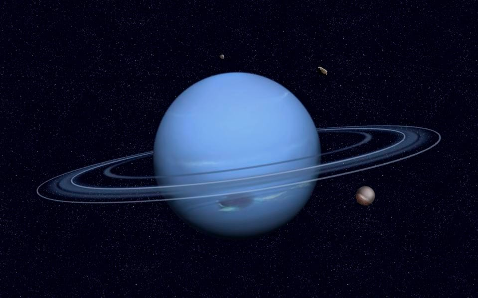
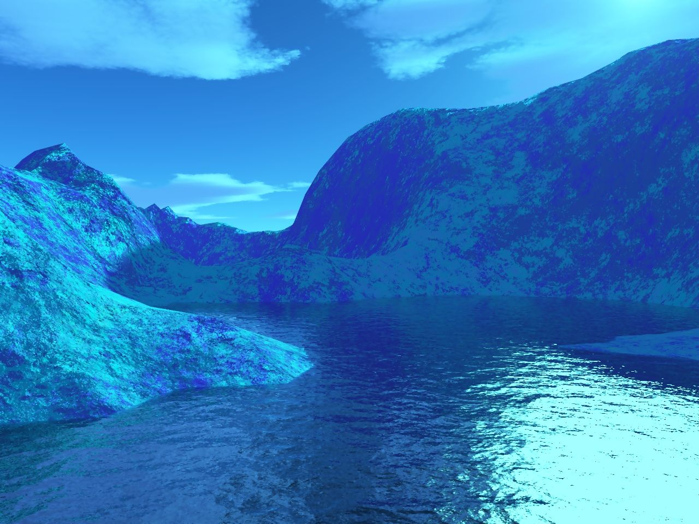
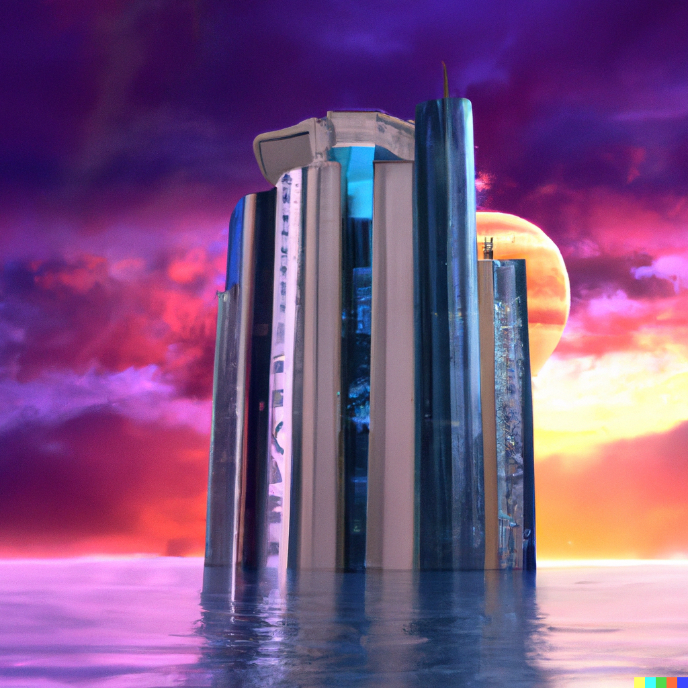

  <!--layout: page
title: "Locations"
permalink: [/URL-PATH](https://evanm07.github.io/The_Space_Station/locations/neptune)
title:false
-->
  <link rel="stylesheet" type="text/css" href="../css/style.scss" />
  <link rel="stylesheet" type="text/css" href="../css/location.css" />

  <body>
    <h1>The Water World</h1>

    <main>
      <section class="img_container">
        
        
        <section>
          

            
The History

            

Neptune is the eighth planet from the sun and the fourth largest in our solar system. It's known for its beautiful blue color, which is caused by methane in its atmosphere. Neptune is so far from the sun that it takes almost 165 Earth years to orbit the sun just once! Despite being so far away, Neptune is still pretty hot, with temperatures reaching as high as -353 degrees Fahrenheit. It also has the strongest winds in the solar system, reaching speeds of over 1,000 miles per hour! But don't worry, you won't be able to feel them from the safety of the submarine and hotel. Neptune is a mysterious and fascinating place, and we have much more to learn about it.

"Get ready to blast off on an interplanetary adventure through the far-reaching corners of our solar system, to the blue giant planet with a majestic methane-induced hue, a bone-chilling temperature range, and the strongest winds in the solar system!" 

</section>

</section>

      <section>
        

          <h2>About the Trip and Hotel</h2>
          

            <ui>
              <li><strong>Distance: </strong> Approx 4.4 billion km</li>
              <li><strong>Travel Time: </strong> 6 days</li>
              <li>
                <strong>Length of Stay:</strong> One Week not including travel
                time
              </li>
              <li><strong>All in Price:</strong> $500,000</li>
            </ui>
          

          

            <li>
              <strong>Amenities: </strong>  
              Hot tub  
              Five Star breakfast lunch and dinner  
              Beautiful private rooms  
              Stunning view of the earth  
              Submarine tours  
              Diving lessons and trips
            </li>
          

        

      </section>
    </main>

  <button id="home_btn">
    <a href="https://evanm07.github.io/The_Space_Station/"> 
    Home </a> 
  </button>
  
  </body>

  <!--</body>-->
