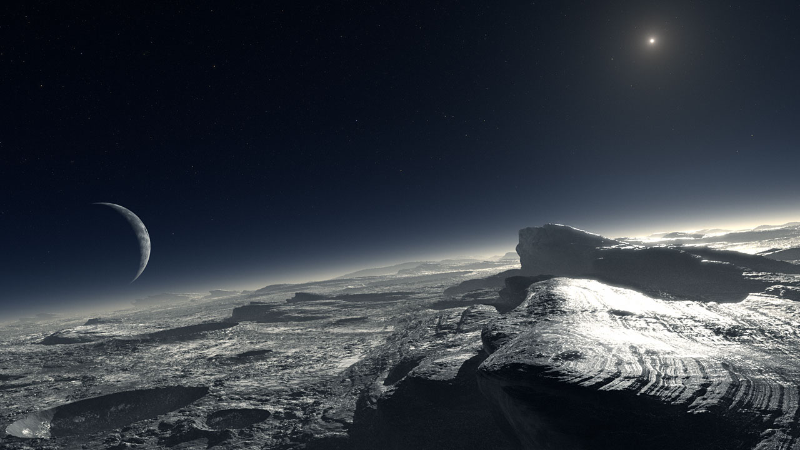
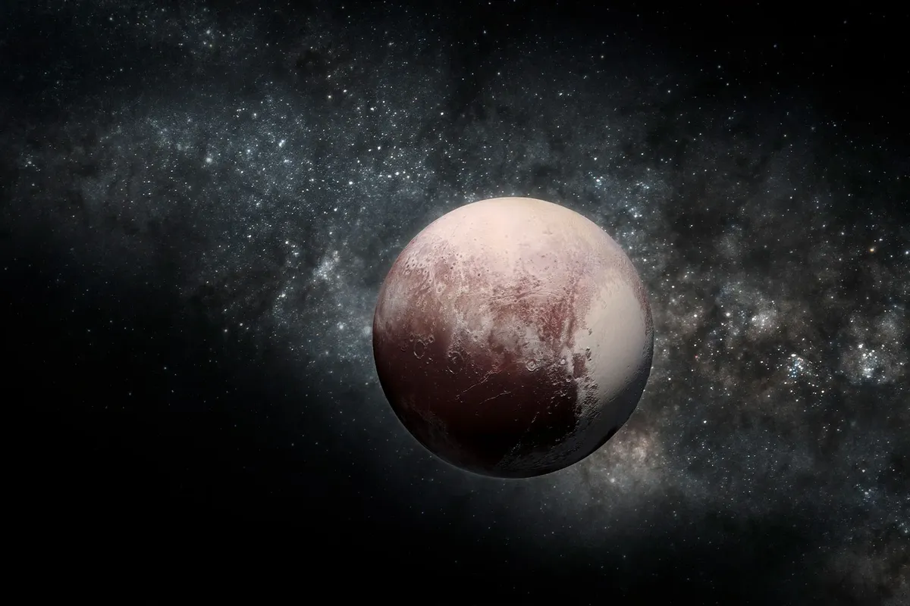
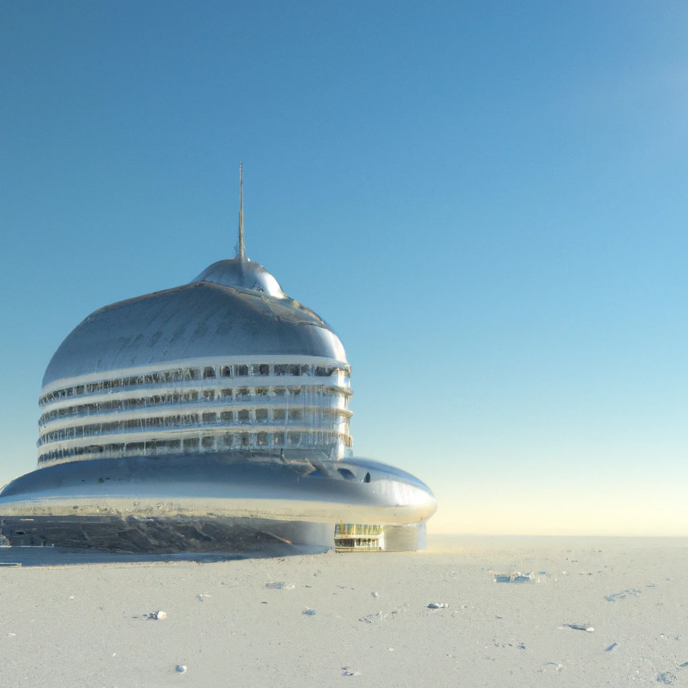
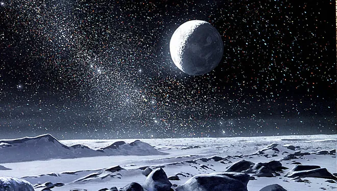

  <!--layout: page
title: "Locations"
permalink: [/URL-PATH](https://evanm07.github.io/The_Space_Station/locations/pluto)
title:false
-->
  <link rel="stylesheet" type="text/css" href="../css/style.scss" />
  <link rel="stylesheet" type="text/css" href="../css/location.css" />

  <body>
    <h1>Once a planet but anymore</h1>

    <main>
      <section class="img_container">
        
        
        <section>
          

            
The History

            

              Pluto is a small, icy world that orbits the sun in the Kuiper
              Belt, a region of small, icy bodies beyond Neptune. It was
              discovered in 1930 and was initially classified as the ninth
              planet in the solar system. However, in 2006, the International
              Astronomical Union (IAU) reclassified Pluto as a "dwarf planet," a
              classification that recognizes it as a distinct and significant
              object in the solar system, but not as a full-fledged planet.
              Pluto is about 2,377 kilometers (1,478 miles) in diameter and is
              made up of a mixture of rock and ice. It has a highly eccentric
              orbit that takes it from inside the orbit of Neptune to nearly 50
              times farther from the sun than Earth. Pluto has five known moons.
              Pluto is a fascinating and enigmatic world that has garnered much
              scientific interest, particularly since the 2015 flyby of the New
              Horizons spacecraft, which provided the first close-up images and
              data of the dwarf planet. Further study of Pluto and other objects
              in the Kuiper Belt could help us understand the early history and
              evolution of the solar system.
            

            

              Find out why scientists didn't want to consider pluto a planet!
            

          

        </section>
        
        
      </section>

      <section>
        

          <h2>About the Trip and Hotel</h2>
          

            <ui>
              <li><strong>Distance: </strong> Approx 5.3 billion km</li>
              <li><strong>Travel Time: </strong> Nine Days</li>
              <li>
                <strong>Length of Stay:</strong> One Week not including travel
                time
              </li>
              <li><strong>All in Price:</strong> $300,000</li>
            </ui>
          

          

            <li>
              <strong>Amenities: </strong>  
              Swimming Pool  
              Hot tub  
              Five Star breakfast lunch and dinner  
              Beautiful private rooms  
              Stunning view of the earth  
              Tours of the surface
            </li>
          

        

      </section>
    </main>
    
  <button id="home_btn">
    <a href="https://evanm02.github.io/The_Space_Station/"> 
    Home </a> 
  </button>

  </body>

  <!--</body>-->
