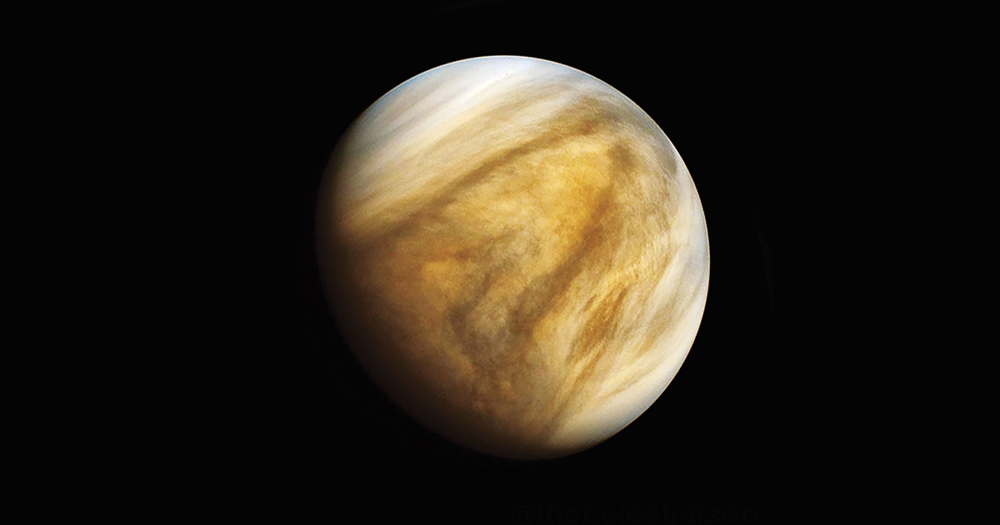
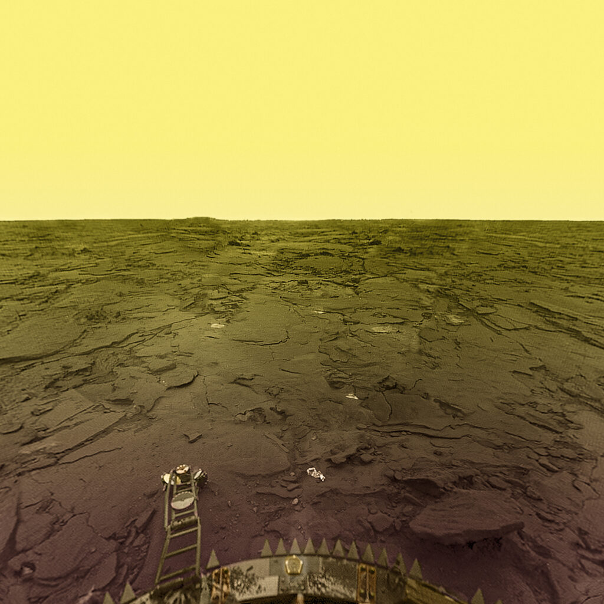
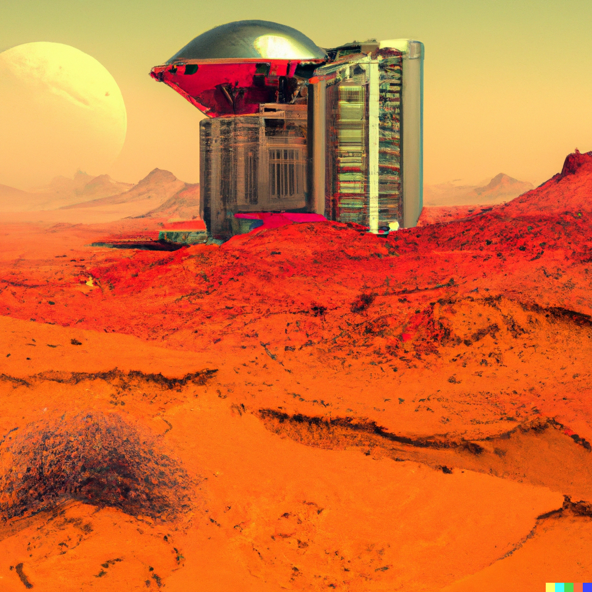
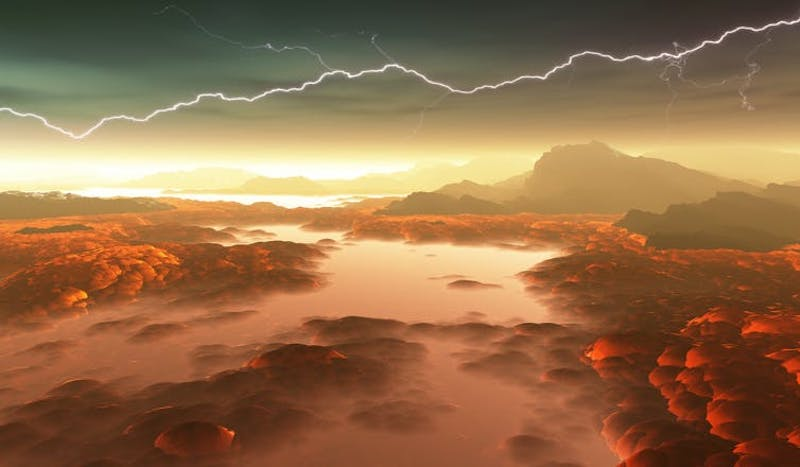

 <!--layout: page
title: "Locations"
permalink: [/URL-PATH](https://evanm07.github.io/The_Space_Station/locations/venus)
title:false
-->
<link rel="stylesheet" type="text/css" href="../css/style.scss" />
<link rel="stylesheet" type="text/css" href="../css/location.css" />

<body>
  <h1> The Sister Planet </h1>

  <main>
    <section class="img_container">
      
      
      <section>
        

          
The History

          

            Venus is the second planet from the sun and is often referred to
            as Earth's sister planet because of its similar size, mass, and
            composition. Venus is about 12,104 kilometers (7,521 miles) in
            diameter and has a surface that is mostly covered by volcanoes and
            mountains. It has a thick, toxic atmosphere made up of carbon
            dioxide and nitrogen, which traps heat and makes Venus the hottest
            planet in the solar system, with surface temperatures reaching up
            to 864 degrees Fahrenheit (462 degrees Celsius). Venus rotates in
            the opposite direction of most planets, meaning that it rotates
            from east to west instead of west to east. It also has no moons or
            rings. Despite its inhospitable surface conditions, Venus has been
            the subject of numerous spacecraft missions, which have revealed
            much about its geology, atmosphere, and history. Understanding
            more about Venus can also help us learn about the evolution of
            Earth and other terrestrial planets.
          

          
Check out our sister planet!

        

      </section>
      
      
    </section>

    <section>
      

        <h2>About the Trip and Hotel</h2>
        

          <ui>
            <li><strong>Distance: </strong> 246.33 million km</li>
            <li><strong>Travel Time: </strong> 6 hours </li>
            <li>
              <strong>Length of Stay:</strong> One Week not including travel
              time
            </li>
            <li><strong>All in Price:</strong> $200,000</li>
          </ui>
        

        

          <li>
            <strong>Amenities: </strong>  
            Swimming Pool  
            Hot tub  
            Five Star breakfast lunch and dinner  
            Beautiful private rooms  
            Views of the surface of the planet  
            Tours of the planets surface
          </li>
        

      

    </section>
    </main>

  <button id="home_btn">
    <a href="https://evanm02.github.io/The_Space_Station/"> 
    Home </a> 
  </button>
  
  </body>

<!--</body>-->
